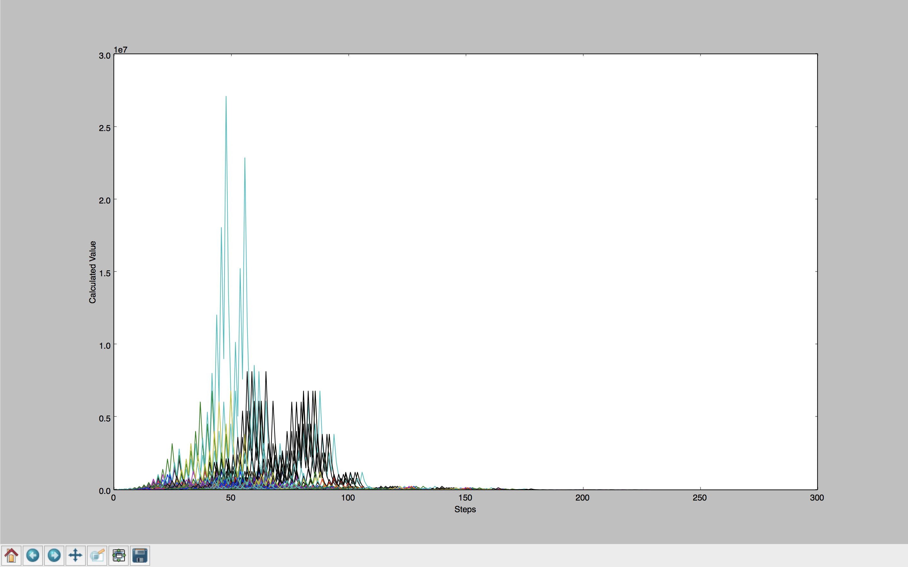

# About

I recently picked up go and read about the Collatz Conjecture. Both are really cool so I thought I'd do a little visualization project. The project relies on Go, Python, and Matplotlib.

# How to use

1. `go build ccg.go`
2. `python graph.py 5 10 118`

The output will be a window that looks similar to 

(This is a graph of all numbers from 1 - 10000)
